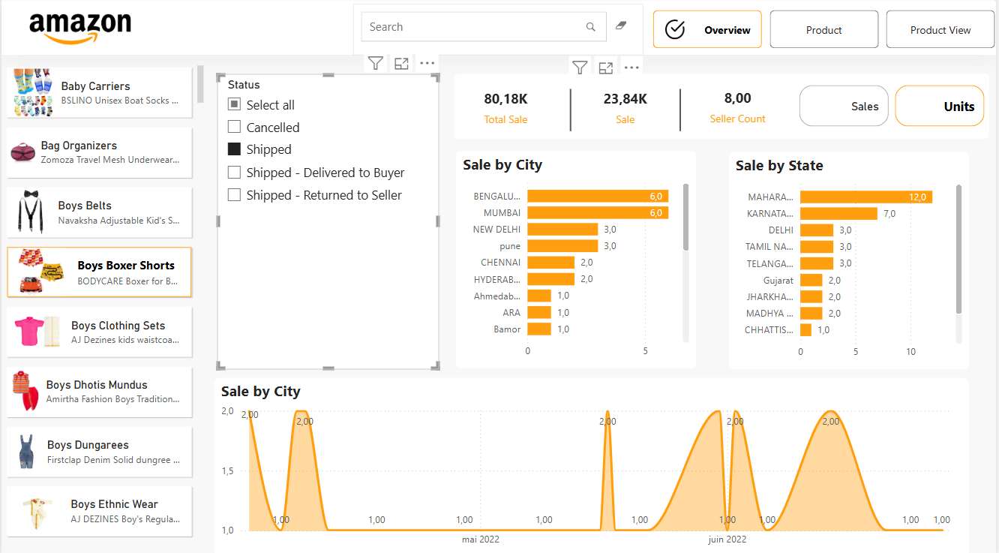

# 📊 Amazon Sales Analytics Dashboard

Welcome to the **Amazon Sales Analytics Dashboard** — an interactive, data-driven dashboard designed to track and visualize key performance indicators (KPIs) for Amazon product sales, returns, and inventory performance.

---

## 🔍 Project Overview

This dashboard provides a comprehensive overview of Amazon sales activity, enabling better decision-making through intuitive visual insights. Built with powerful business intelligence tools, the dashboard helps stakeholders monitor performance, identify trends, and uncover optimization opportunities.

---

## 📈 Features

- 💰 **Total Sales Overview** – Track gross revenue and net profits over time.
- 🔁 **Return Analytics** – Visualize return rates, reasons for return, and product-level return metrics.
- 📦 **Article Performance** – Monitor top-selling and underperforming items.
- 🌍 **Geographic Sales Distribution** – See where your sales are happening.
- 📅 **Dynamic Filtering** – Slice data by date, product category, region, and more.
- ⚙️ **KPI Cards** – Instant view of key metrics like:
  - Total Sales
  - Number of Orders
  - Return Rate
  - Active Articles

---

## 🛠️ Tech Stack

| Tool | Role |
|------|------|
| **Power BI** | Data visualization |
| **Dax** | Data preprocessing |
| **CSV** | Raw data source |

---
